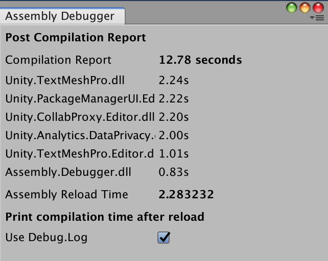

# Unity Assemblies Debugger

Small utility to show the time it takes to compile each assembly after a reload.



## Usage

Just by installing this in your project it will load itself on every reload.

If you want to see the report, you can open the utility window at `Window > Assemblies Debugger`.

### Logs

By default it will use the console to print the total reloading time.

You can see an example log here:

```
Compilation Report: 4.14 seconds
0.62s Unity.TextMeshPro.dll
0.44s Unity.Analytics.DataPrivacy.dll
0.44s Unity.PackageManagerUI.Editor.dll
0.43s Assembly.Debugger.dll
0.42s Unity.CollabProxy.Editor.dll
0.30s Unity.TextMeshPro.Editor.dll
0.24s Assembly-CSharp.dll
Assembly Reload Time: 1.2500003
```

#### Disabling the logs

If you wish to disable the logs, you can set this in the checkbox in the utility window.

### Disabling whole plugin

If, for some reason, you want to disable the plugin without removing it, you can add the Scripting Define Symbol 
`IGNORE_ASMDEF_DEBUG` to your project and it will stop analyzing the reload times.

## Installation

### Adding the package to the Unity project manifest

* Navigate to the `Packages` directory of your project.
* Adjust the [project manifest file][Project-Manifest] `manifest.json` in a text editor.
  * Ensure `https://registry.npmjs.org/` is part of `scopedRegistries`.
    * Ensure `dev.bullrich` is part of `scopes`.
  * Add `dev.bullrich.asmdef-debug` to `dependencies`, stating the latest version.

  A minimal example ends up looking like this. 
  Please note that the version `X.Y.Z` stated here is to be replaced with the latest released version which is currently [![Release][Version-Release]][Releases].
  ```json
  {
    "scopedRegistries": [
      {
        "name": "npmjs",
        "url": "https://registry.npmjs.org/",
        "scopes": [
          "dev.bullrich"
        ]
      }
    ],
    "dependencies": {
      "dev.bullrich.asmdef-debug": "X.Y.Z",
      ...
    }
  }
  ```
* Switch back to the Unity software and wait for it to finish importing the added package.

[Project-Manifest]: https://docs.unity3d.com/Manual/upm-manifestPrj.html
[Version-Release]: https://img.shields.io/github/v/release/Bullrich/Unity-Assembly-Debugger
[Releases]: https://github.com/Bullrich/Unity-Assembly-Debugger/releases